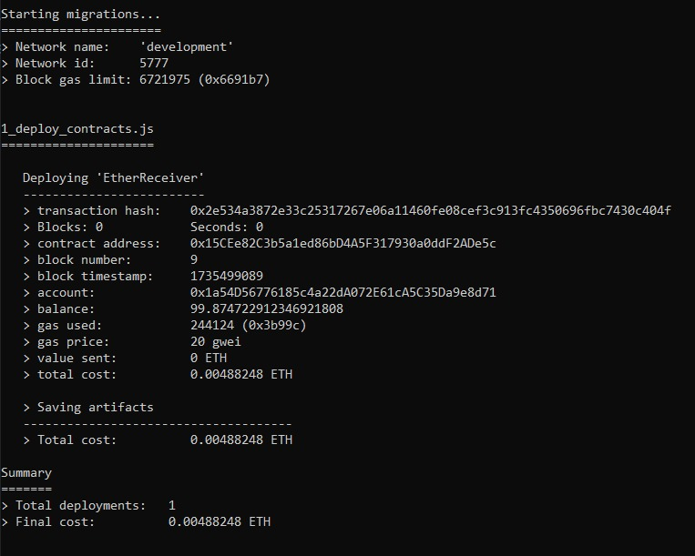
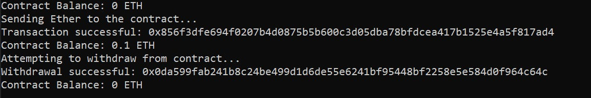

# EtherReceiver Smart Contract

## Overview
The **EtherReceiver Smart Contract** is a simple Ethereum smart contract that enables:
- Receiving Ether.
- Allowing the contract owner to withdraw Ether.
- Checking the contract balance.

This README provides a detailed guide on deployment, interaction, and usage of the contract.

---

## Features
- **Receive Ether:** Accepts Ether sent to the contract.
- **Owner-only Withdrawals:** Restricts withdrawals to the contract owner.
- **Balance Check:** Provides a way to query the contract’s Ether balance.

---

## Usage

### Steps to run the project:

1. Clone the repository:

   ```bash
   git clone https://github.com/nur1kesh/EtherReceiver.git
   cd EtherReceiver

2. Install required dependencies:

   ```bash
   npm install

3. Make sure you have the .secret file in the root directory, which contains your private key. You can generate this using a service like MetaMask or Ganache.

4. Configure the network:
- Set the network variable in interact.js to either 'ganache' or 'sepolia' depending on your preferred network.

5. Start your Ganache instance or connect to Sepolia via Infura.

6. Run interact.js to interact with the smart contract:

   ```bash
   node interact.js

---

## Deployment

- **Network Name:** Development (Ganache)
- **Contract Address:** `0x15CEe82C3b5a1ed86bD4A5F317930a0ddF2ADe5c`
- **Transaction Hash:** `0x2e534a3872e33c25317267e06a11460fe08cef3c913fc4350696fbc7430c404f`

---

## Interactions

1. **Sending Ether**
   - Sent **0.1 ETH** to the contract.
   - **Transaction Hash:** `0x856f3dfe694f0207b4d0875b5b600c3d05dba78bfdcea417b1525e4a5f817ad4`

2. **Withdrawing Ether**
   - The contract owner successfully withdrew all Ether.
   - **Transaction Hash:** `0x0da599fab241b8c24be499d1d6de55e6241bf95448bf2258e584d0f964c64c`

3. **Checking Contract Balance**
   - **Before Sending Ether:** `0 ETH`
   - **After Sending Ether:** `0.1 ETH`
   - **After Withdrawal:** `0 ETH`

---

## Screenshots

### Contract Deployment


### Contract Interaction


---

## Example Code

### Smart Contract Code
```solidity
// SPDX-License-Identifier: MIT
pragma solidity ^0.8.0;

contract EtherReceiver {
    address public owner;

    constructor() {
        owner = msg.sender;
    }

    // Function to receive Ether
    receive() external payable {}

    // Function to check contract balance
    function checkBalance() public view returns (uint) {
        return address(this).balance;
    }

    // Function to withdraw Ether by the owner
    function withdraw() public {
        require(msg.sender == owner, "Only the owner can withdraw");
        payable(owner).transfer(address(this).balance);
    }
}
```
---

## License

This project is licensed under the MIT License - see the [LICENSE](./LICENSE) file for details.
